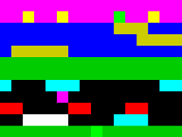
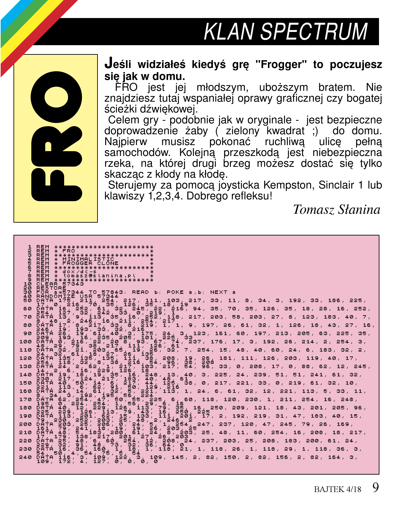

# FRO
Minimalistic Frogger clone in less than 500 bytes
## Tech
* ZX Spectrum 48
* Z80 Assembler ( <500 bytes executable size)
## Screenshot

## Controlls
* Kempston OR Sinclair 1 / Keyboard (keys 1,2,3,4)
## Bonus ;)

## Build instruction
* Use Pasmo to build (build.sh for MacOS)

## Authors
* **Tomasz Słanina** - [dox](https://github.com/tslanina)
## License
This project is licensed under the GPL v3 License - see the [LICENSE](LICENSE) file for details
